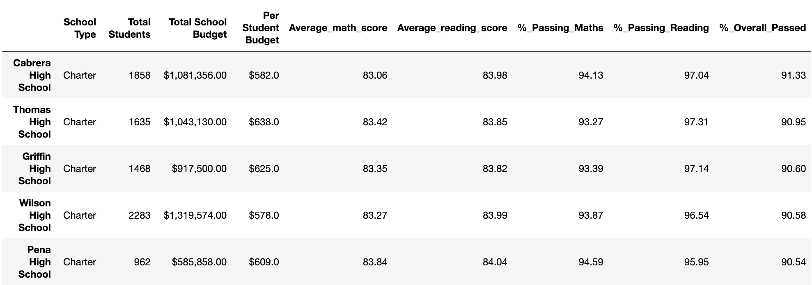
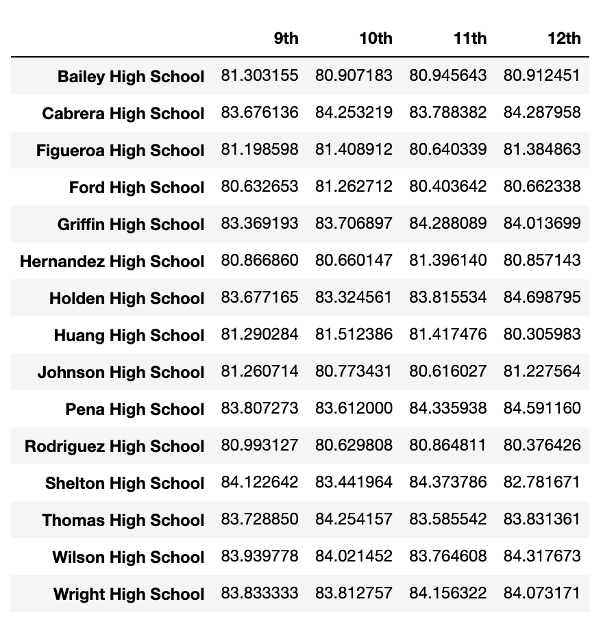
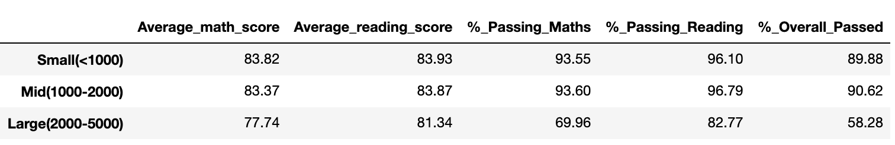

# PandasChallenege2 --- PyCitySchools

The task is to help the  school board and mayor make strategic decisions regarding future school budgets and priorities.
The final report contains the following information:

### District Summary

### School Summary

### Top Performing Schools (By % Overall Passing)

### Bottom Performing Schools (By % Overall Passing)

### Math Scores by Grade

### Reading Scores by Grade

### Scores by School Spending

### Scores by School Size

### Scores by School Type

